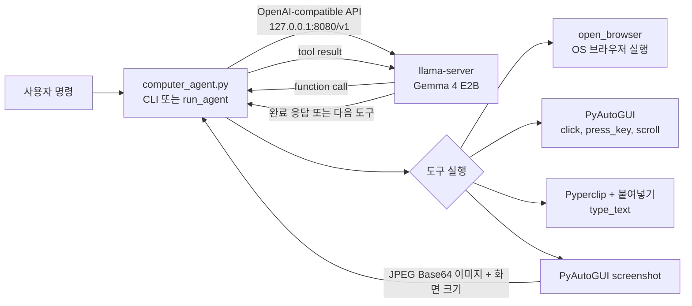

# Local Computer Use Agent with Gemma 4 E2B

> 이 프로그램은 실제 마우스와 키보드를 제어합니다. 
> 실행 중에는 마우스를 화면 왼쪽 위 모서리로 옮겨 PyAutoGUI failsafe를 발동할 수 있습니다.

## 1. 전제 조건

- 멀티모달 입력을 지원하도록 실행한 `llama-server`
- macOS, Windows 또는 Linux의 Python 3 환경
- 화면 캡처와 입력 제어 권한. macOS에서는 실행 주체(터미널 또는 VS Code)에 **화면 및 시스템 오디오 녹음** 및 **손쉬운 사용** 권한이 필요합니다.

## 2. 의존성 설치

```bash
python -m venv .venv
source .venv/bin/activate
python -m pip install -U openai pyautogui pyperclip pillow fastapi uvicorn
```

## 3. 전체 아키텍처



```text
┌───────────────────────────────────────────────┐
│                    사용자 PC                    │
│                                               │
│  사용자                                         │
│   │                                           │
│   │ 자연어 명령                                  │
│   ▼                                           │
│ ┌───────────────────────────────────────────┐ │
│ │       Python Computer Use Agent           │ │
│ │                                           │ │
│ │  - 사용자 명령 수신                           │ │
│ │  - Tool Call 처리                          │ │
│ │  - 화면 캡처                                │ │
│ │  - 마우스/키보드 제어                         │ │
│ └──────────────────┬────────────────────────┘ │
│                    │                          │
│                    │ OpenAI-compatible API    │
│                    ▼                          │
│ ┌───────────────────────────────────────────┐ │
│ │              llama-server                 │ │
│ │               :8080                       │ │
│ │                                           │ │
│ │             Gemma 4 E2B                   │ │
│ └──────────────────┬────────────────────────┘ │
│                    │                          │
│                    ▼                          │
│               Tool Call                       │
│                    │                          │
│       ┌────────────┼────────────┐             │
│       ▼            ▼            ▼             │
│   screenshot     click      type_text         │
│       │            │            │             │
│       ▼            ▼            ▼             │
│    화면 읽기       마우스         키보드            │
│                                               │
│                    │                          │
│                    ▼                          │
│                 현재 화면                       │
│                    │                          │
│                    └──────→ screenshot        │
└───────────────────────────────────────────────┘
```

Gemma 4 E2B는 무엇을 해야 하는지 판단하고,

Python Agent가 실제 마우스/키보드/브라우저 작업을 수행합니다.

---

## 4. 실행 방법

### llama.cpp 설치

#### Windows PowerShell

```powershell
winget install llama.cpp
llama-server.exe --version
```

WinGet을 사용할 수 없다면 [llama.cpp Releases](https://github.com/ggml-org/llama.cpp/releases)에서 Windows용 ZIP을 내려받아 압축을 풀고, `llama-server.exe`가 있는 폴더를 `PATH`에 추가합니다.

#### macOS

```bash
brew install llama.cpp
llama-server --version
```

Apple Silicon용 Homebrew 설치본은 Metal 가속을 기본으로 사용합니다.

최신 배포판에 `llama-server` 대신 통합 CLI만 포함된 경우 `llama version`으로 설치를 확인합니다. 아래의 `llama-server` 명령은 `llama serve`로 바꿔 실행합니다.

### 모델 서버 실행

가장 간단한 방법은 `-hf` 옵션으로 모델을 자동 다운로드하는 것입니다. 처음 실행하면 모델 파일이 Hugging Face 캐시에 저장됩니다.

터미널 1:

```bash
llama-server \
  -hf ggml-org/gemma-4-E2B-it-GGUF \
  --host 127.0.0.1 \
  --port 8080 \
  --jinja \
  -c 32768
```

서버 주소:

```text
http://127.0.0.1:8080/v1
```

---

### Computer Use Agent 시작

터미널 2:

```bash
python computer_agent.py
```

정상 실행 예:

```text
============================================================
Local Computer Use Agent
============================================================
LLAMA SERVER: http://127.0.0.1:8080/v1
MODEL: gemma-4-E2B-it-GGUF
OS: Darwin
SCREEN: 2560 x 1600
============================================================
종료: exit / quit / 종료

명령 >
```

---

## 5. 기본 사용 예

### Chrome으로 네이버 열기

```text
크롬으로 네이버 열어줘
```

모델이 다음 Tool을 호출합니다.

```json
{
  "name": "open_browser",
  "arguments": {
    "browser": "chrome",
    "url": "https://www.naver.com"
  }
}
```

### 연속 작업 예

```text
크롬으로 네이버 열고 양산시청 검색해줘
```

### 상세 검색 예

```text
크롬으로 네이버를 열고 검색창을 클릭한 다음 양산시청을 입력하고 검색 버튼을 눌러줘
```

### 화면 인식 예

```text
현재 화면에서 검색창의 위치를 찾아줘
```

### 스크롤 예

```text
현재 페이지를 아래로 스크롤해줘
```

## 6. 도구 상세

### open_browser

브라우저를 실행하고 URL을 엽니다.

```text
open_browser(
    browser="chrome",
    url="https://www.naver.com"
)
```

지원 브라우저:

```text
chrome
safari
edge
firefox
ie
```

브라우저 별칭도 일부 처리합니다.

```text
크롬
클롬
사파리
엣지
파이어폭스
익스플로러
```

---

### screenshot

현재 PC 화면을 캡처합니다.

```text
screenshot()
```

캡처 결과는 Base64 JPEG 이미지로 변환되어
Gemma 4 E2B에게 다시 전달됩니다.

화면 판단이 필요한 경우:

```text
screenshot
   ↓
이미지 입력
   ↓
Gemma 판단
   ↓
다음 Tool 호출
```

의 구조입니다.

---

### click

화면을 클릭합니다.

```text
click(
    x=500,
    y=500
)
```

### 좌표 체계

Gemma가 사용하는 좌표는 0~1000 정규화 좌표를 사용합니다.

```text
왼쪽 위      (0, 0)

중앙         (500, 500)

오른쪽 아래  (1000, 1000)
```

Python에서 실제 macOS/Windows 화면 좌표로 변환합니다.

예:

```text
모델 좌표
(500, 500)

      ↓

실제 화면
(1280, 800)
```

화면 크기에 따라 실제 좌표는 달라집니다.

---

### type_text

현재 포커스된 입력창에 텍스트를 입력합니다.

한글 입력을 위해 `pyautogui.write()` 대신
클립보드 + 붙여넣기 방식으로 구현합니다.

```text
type_text(
    text="양산시청"
)
```

macOS:

```text
Command + V
```

Windows/Linux:

```text
Ctrl + V
```

---

### press_key

키보드 키를 입력합니다.

예:

```text
press_key(
    key="enter"
)
```

지원 예:

```text
enter
esc
tab
space
backspace
delete
home
end
up
down
left
right
pageup
pagedown
f5
```

---

### scroll

스크롤합니다.

```text
scroll(
    amount=-5
)
```

양수:

```text
위쪽
```

음수:

```text
아래쪽
```

---

### wait

페이지 로딩 등을 위해 잠시 기다립니다.

```text
wait(
    seconds=1
)
```

현재 최대 5초까지 제한합니다.

---

---

## 7. 화면 캡처 처리

초기 테스트에서 다음 오류가 발생했습니다.

```text
OSError: cannot write mode RGBA as JPEG
```

원인은 macOS 캡처 이미지가 RGBA 모드였기 때문입니다.

현재 코드에서는 다음처럼 해결합니다.

```python
if image.mode != "RGB":
    image = image.convert("RGB")
```

그리고 JPEG로 변환합니다.

```python
image.save(
  buffer,
  format="JPEG",
  quality=82,
  optimize=True
)
```
