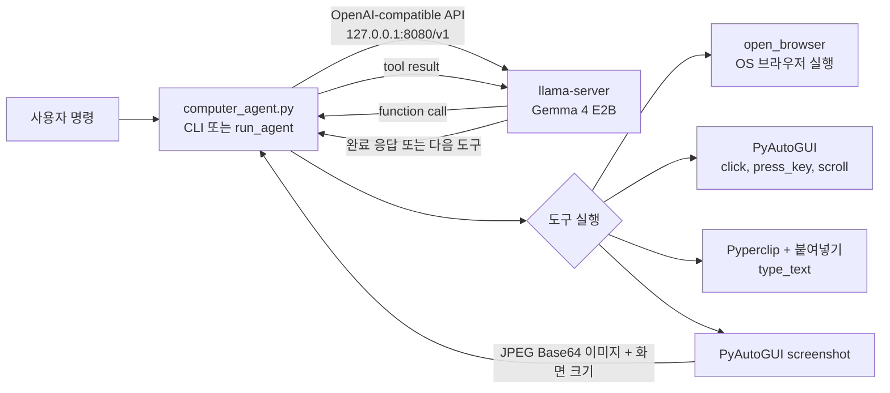
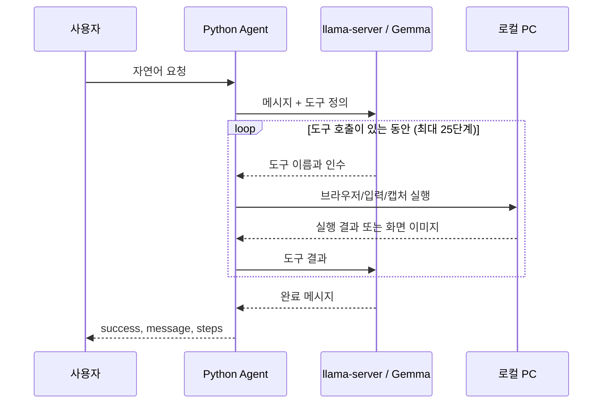

# Local Computer Use Agent with Gemma 4 E2B

> 상태: POC. 이 프로그램은 실제 마우스와 키보드를 제어합니다. 전용 테스트 계정과 테스트 화면에서만 사용하고, 실행 중에는 마우스를 화면 왼쪽 위 모서리로 옮겨 PyAutoGUI failsafe를 발동할 수 있습니다.

## 빠른 시작

### 1. 전제 조건

- 멀티모달 입력을 지원하도록 실행한 `llama-server`
- macOS, Windows 또는 Linux의 Python 3 환경
- 화면 캡처와 입력 제어 권한. macOS에서는 실행 주체(터미널 또는 VS Code)에 **화면 및 시스템 오디오 녹음** 및 **손쉬운 사용** 권한이 필요합니다.

### 2. 의존성 설치

```bash
python -m venv .venv
source .venv/bin/activate
python -m pip install -U openai pyautogui pyperclip pillow fastapi uvicorn
```

Windows PowerShell에서는 가상환경 활성화 명령이 `.venv\Scripts\Activate.ps1`입니다.

### 3. 모델 서버 실행

```bash
llama-server \
  -hf ggml-org/gemma-4-E2B-it-GGUF \
  --host 127.0.0.1 \
  --port 8080 \
  --jinja \
  -c 32768
```

`--no-mmproj`를 사용하면 화면 이미지를 모델에 전달할 수 없으므로 사용하지 않습니다.

### 4. Agent 실행

주 실행 파일은 `computer_agent.py`입니다. 기본값은 대화형 CLI입니다.

```bash
python computer_agent.py
```

환경 변수로 서버 주소와 모델 식별자를 바꿀 수 있습니다.

```bash
LLAMA_BASE_URL=http://127.0.0.1:8080/v1 \
MODEL_NAME=gemma-4-E2B-it-GGUF \
python computer_agent.py
```

간소 브라우저 열기 HTTP API만 필요할 때는 `agent_server.py`를 실행합니다.

```bash
uvicorn agent_server:app --host 127.0.0.1 --port 8000
curl -X POST http://127.0.0.1:8000/run \
  -H 'Content-Type: application/json' \
  -d '{"message":"크롬으로 네이버 열어줘"}'
```

`agent_server.py`는 `open_browser`만 호출합니다. 화면 캡처, 클릭, 입력을 포함한 Computer Use 루프는 `computer_agent.py`에 구현되어 있습니다.

## 구현 기준 아키텍처



`screenshot` 결과는 JPEG Base64로 변환되어 도구 결과 메시지의 이미지 입력으로 모델에 전달됩니다. 클릭 좌표는 모델이 지정하는 $0$~$1000$ 정규화 좌표이며, Agent가 실제 화면 크기에 맞춰 변환합니다.

## 구성 파일

| 파일                  | 역할                                                                    | 실행 방식                                                 |
| --------------------- | ----------------------------------------------------------------------- | --------------------------------------------------------- |
| `computer_agent.py` | 멀티모달 Computer Use Agent. 6개 도구와 최대 25단계의 Agent 루프를 제공 | `python computer_agent.py`                              |
| `agent_server.py`   | `open_browser`만 제공하는 단일 단계 FastAPI 예제                      | `uvicorn agent_server:app --host 127.0.0.1 --port 8000` |
| `README.MD`         | 실행 및 설계 문서                                                       | -                                                         |

## 실제 제공 도구

| 도구                           | 용도                           | 제약                                      |
| ------------------------------ | ------------------------------ | ----------------------------------------- |
| `open_browser(browser, url)` | 지정 브라우저와 URL 열기       | OS와 설치된 브라우저에 따름               |
| `screenshot()`               | 현재 화면을 캡처해 모델에 제공 | 화면 기록 권한 필요                       |
| `click(x, y, button)`        | 정규화 좌표를 클릭             | `x`, `y`: 0~1000, 버튼: left/right    |
| `type_text(text)`            | 포커스된 입력란에 붙여넣기     | 한글 입력은 클립보드 붙여넣기 사용        |
| `press_key(key)`             | 허용된 특수 키 입력            | enter, tab, 방향키 등 사전 정의 키만 허용 |
| `scroll(amount)`             | 현재 화면 스크롤               | -10~10으로 제한                           |
| `wait(seconds)`              | 로딩 등 대기                   | 0.2~5초로 제한                            |

## 요청과 응답

`computer_agent.py`의 `run_agent()`는 모델이 도구 호출 없이 종료할 때까지 도구 결과를 다시 전달하며, 요청당 최대 25단계를 실행합니다.



로컬 PC에서 **Gemma 4 E2B + llama-server + Python Agent**를 이용해
사용자의 자연어 명령으로 브라우저와 PC 화면을 제어하는 Computer Use 실험 프로젝트입니다.

현재 구현의 핵심 목표는 다음과 같습니다.

> "크롬으로 네이버 열어서 양산시청 검색해줘"

와 같은 자연어 명령을 입력하면,

```text
사용자
  ↓
Python Computer Use Agent
  ↓
llama-server
  ↓
Gemma 4 E2B
  ↓
Tool Call
  ↓
실제 PC 조작
  ↓
화면 캡처
  ↓
Gemma 4 E2B가 다음 행동 결정
  ↺
```

의 루프를 통해 실제 컴퓨터를 조작하는 것입니다.

---

## 1. 프로젝트 개요

### 목표

클라우드 AI 서비스에 화면이나 업무 정보를 보내지 않고,
사용자 PC 내부에서 로컬 모델을 이용해 다음과 같은 작업을 수행합니다.

- 브라우저 실행
- 특정 URL 열기
- 화면 캡처
- 화면의 UI 위치 판단
- 마우스 클릭
- 한글 텍스트 입력
- 키보드 입력
- 스크롤
- 대기
- 다음 화면을 다시 분석하여 연속 작업 수행

현재는 **POC(Proof of Concept)** 단계입니다.

---

## 2. 전체 아키텍처

```text
┌───────────────────────────────────────────────┐
│                    사용자 PC                   │
│                                               │
│  사용자                                        │
│   │                                           │
│   │ 자연어 명령                                │
│   ▼                                           │
│ ┌───────────────────────────────────────────┐ │
│ │       Python Computer Use Agent           │ │
│ │                                           │ │
│ │  - 사용자 명령 수신                        │ │
│ │  - Tool Call 처리                          │ │
│ │  - 화면 캡처                               │ │
│ │  - 마우스/키보드 제어                       │ │
│ └──────────────────┬────────────────────────┘ │
│                    │                          │
│                    │ OpenAI-compatible API   │
│                    ▼                          │
│ ┌───────────────────────────────────────────┐ │
│ │              llama-server                 │ │
│ │               :8080                       │ │
│ │                                           │ │
│ │             Gemma 4 E2B                  │ │
│ └──────────────────┬────────────────────────┘ │
│                    │                          │
│                    ▼                          │
│               Tool Call                      │
│                    │                          │
│       ┌────────────┼────────────┐             │
│       ▼            ▼            ▼             │
│   screenshot     click      type_text        │
│       │            │            │             │
│       ▼            ▼            ▼             │
│    화면 읽기     마우스        키보드          │
│                                               │
│                    │                          │
│                    ▼                          │
│                 현재 화면                     │
│                    │                          │
│                    └──────→ screenshot        │
└───────────────────────────────────────────────┘
```

핵심은 **LLM과 실제 PC 제어기를 분리하는 것**입니다.

Gemma 4 E2B는 무엇을 해야 하는지 판단하고,
Python Agent가 실제 마우스/키보드/브라우저 작업을 수행합니다.

---

## 3. 현재 사용 모델

현재 사용 모델:

```text
ggml-org/gemma-4-E2B-it-GGUF
```

llama-server 실행 예:

```bash
llama-server \
  -hf ggml-org/gemma-4-E2B-it-GGUF \
  --host 127.0.0.1 \
  --port 8080 \
  --jinja \
  -c 32768
```

### 중요

화면 캡처를 모델에 이미지로 전달하므로 다음 옵션은 사용하지 않습니다.

```text
--no-mmproj
```

즉, **멀티모달 입력이 가능한 상태로 llama-server를 실행해야 합니다.**

---

## 4. 개발 환경

현재 테스트 환경 예시:

```text
OS       : macOS
Python   : 3.13
Virtual Environment : .venv
LLM API  : http://127.0.0.1:8080/v1
Agent    : http://127.0.0.1:8000
Model    : gemma-4-E2B-it-GGUF
```

---

## 5. Python 패키지 설치

가상환경을 활성화한 후:

```bash
pip install -U \
  openai \
  pyautogui \
  pyperclip \
  pillow \
  fastapi \
  uvicorn
```

---

## 6. 프로젝트 파일

최소 구조:

```text
5topilot_team/
│
├── .venv/
│
├── agent_server.py
│
├── computer_agent.py
│
└── README.MD
```

현재 핵심 실행 파일:

```text
computer_agent.py
```

보조 파일 `agent_server.py`는 `open_browser`만 제공하는 FastAPI 예제입니다. `computer_agent.py`는 전체 Computer Use 도구와 FastAPI 앱 객체를 함께 제공합니다.

---

## 7. 실행 방법

### 7-1. llama-server 시작

터미널 1:

```bash
llama-server \
  -hf ggml-org/gemma-4-E2B-it-GGUF \
  --host 127.0.0.1 \
  --port 8080 \
  --jinja \
  -c 32768
```

서버 주소:

```text
http://127.0.0.1:8080/v1
```

---

### 7-2. Computer Use Agent 시작

터미널 2:

```bash
python computer_agent.py
```

정상 실행 예:

```text
============================================================
Local Computer Use Agent
============================================================
LLAMA SERVER: http://127.0.0.1:8080/v1
MODEL: gemma-4-E2B-it-GGUF
OS: Darwin
SCREEN: 2560 x 1600
============================================================
종료: exit / quit / 종료

명령 >
```

### 7-3. HTTP API로 실행

`computer_agent.py`는 직접 실행 시 CLI를 시작합니다. HTTP API를 사용하려면 Uvicorn으로 앱 객체를 실행합니다. `agent_server.py`가 기본 포트 `8000`을 사용하므로, 동시에 실행할 때는 다른 포트를 사용합니다.

```bash
uvicorn computer_agent:app --host 127.0.0.1 --port 8001
```

```bash
curl -X POST http://127.0.0.1:8001/run \
  -H 'Content-Type: application/json' \
  -d '{"message":"현재 화면을 아래로 스크롤해줘"}'
```

응답에는 작업 성공 여부, Agent의 최종 메시지, 실행 단계 수가 포함됩니다.

---

## 8. 기본 사용 예

### Chrome으로 네이버 열기

```text
크롬으로 네이버 열어줘
```

모델이 다음 Tool을 호출합니다.

```json
{
  "name": "open_browser",
  "arguments": {
    "browser": "chrome",
    "url": "https://www.naver.com"
  }
}
```

---

### 네이버에서 검색

```text
크롬으로 네이버 열어서 양산시청 검색해줘
```

이상적인 실행 흐름:

```text
[STEP 1]
open_browser

[STEP 2]
screenshot

[STEP 3]
click

[STEP 4]
type_text
양산시청

[STEP 5]
press_key
enter

[STEP 6]
screenshot
```

실제 환경에서는 검색창이 이미 포커스된 경우
`click` 없이 `type_text`가 호출될 수도 있습니다.

---

## 9. 현재 지원 Tool

### open_browser

브라우저를 실행하고 URL을 엽니다.

```text
open_browser(
    browser="chrome",
    url="https://www.naver.com"
)
```

지원 브라우저:

```text
chrome
safari
edge
firefox
ie
```

브라우저 별칭도 일부 처리합니다.

```text
크롬
클롬
사파리
엣지
파이어폭스
익스플로러
```

---

### screenshot

현재 PC 화면을 캡처합니다.

```text
screenshot()
```

캡처 결과는 Base64 JPEG 이미지로 변환되어
Gemma 4 E2B에게 다시 전달됩니다.

화면 판단이 필요한 경우:

```text
screenshot
   ↓
이미지 입력
   ↓
Gemma 판단
   ↓
다음 Tool 호출
```

의 구조입니다.

---

### click

화면을 클릭합니다.

```text
click(
    x=500,
    y=500
)
```

### 좌표 체계

Gemma가 사용하는 좌표는 0~1000 정규화 좌표를 사용합니다.

```text
왼쪽 위      (0, 0)

중앙         (500, 500)

오른쪽 아래  (1000, 1000)
```

Python에서 실제 macOS/Windows 화면 좌표로 변환합니다.

예:

```text
모델 좌표
(500, 500)

      ↓

실제 화면
(1280, 800)
```

화면 크기에 따라 실제 좌표는 달라집니다.

---

### type_text

현재 포커스된 입력창에 텍스트를 입력합니다.

한글 입력을 위해 `pyautogui.write()` 대신
클립보드 + 붙여넣기 방식으로 구현합니다.

```text
type_text(
    text="양산시청"
)
```

macOS:

```text
Command + V
```

Windows/Linux:

```text
Ctrl + V
```

---

### press_key

키보드 키를 입력합니다.

예:

```text
press_key(
    key="enter"
)
```

지원 예:

```text
enter
esc
tab
space
backspace
delete
home
end
up
down
left
right
pageup
pagedown
f5
```

---

### scroll

스크롤합니다.

```text
scroll(
    amount=-5
)
```

양수:

```text
위쪽
```

음수:

```text
아래쪽
```

---

### wait

페이지 로딩 등을 위해 잠시 기다립니다.

```text
wait(
    seconds=1
)
```

현재 최대 5초까지 제한합니다.

---

## 10. Computer Use Agent Loop

현재 Agent의 가장 중요한 부분은 다음 반복 구조입니다.

```text
사용자 요청
    ↓
Gemma 4 E2B
    ↓
Tool Call
    ↓
Python Tool 실행
    ↓
Tool 결과
    ↓
Gemma 4 E2B
    ↓
다음 Tool Call
    ↓
...
```

예를 들어:

```text
"네이버에서 양산시청을 검색해줘"
```

라면:

```text
1. open_browser
2. screenshot
3. click
4. type_text("양산시청")
5. press_key("enter")
6. screenshot
7. 완료 판단
```

형태가 됩니다.

---

## 11. 화면 캡처 처리

초기 테스트에서 다음 오류가 발생했습니다.

```text
OSError: cannot write mode RGBA as JPEG
```

원인은 macOS 캡처 이미지가 RGBA 모드였기 때문입니다.

현재 코드에서는 다음처럼 해결합니다.

```python
if image.mode != "RGB":
    image = image.convert("RGB")
```

그리고 JPEG로 변환합니다.

```python
image.save(
    buffer,
    format="JPEG",
    quality=82,
    optimize=True
)
```

---

## 12. macOS 권한

브라우저 실행과 화면 제어가 제대로 되지 않을 경우
macOS 권한을 확인합니다.

### 화면 기록

경로:

```text
시스템 설정
→ 개인정보 보호 및 보안
→ 화면 및 시스템 오디오 녹음
```

사용 중인 터미널 앱에 권한을 부여합니다.

예:

```text
Terminal
iTerm
Visual Studio Code
PyCharm
```

---

### 손쉬운 사용

경로:

```text
시스템 설정
→ 개인정보 보호 및 보안
→ 손쉬운 사용
```

사용 중인 터미널/실행 앱에 권한을 부여합니다.

이 권한은 다음 기능에 필요합니다.

```text
화면 캡처
마우스 제어
키보드 제어
```

---

## 13. 실제 테스트 과정에서 확인된 문제

### 문제 1. RGBA JPEG 오류

오류:

```text
OSError: cannot write mode RGBA as JPEG
```

해결:

```python
image = image.convert("RGB")
```

---

### 문제 2. 한글 입력 오류

초기 버전에서 모델이 다음과 같은 잘못된 입력을 생성할 가능성이 있었습니다.

```text
"ㅍ"
```

이 문제는 두 가지로 구분해야 합니다.

#### A. Tool Call 자체가 잘못된 경우

```text
[TOOL] type_text
{'text': 'ㅍ'}
```

이 경우:

```text
Gemma가 잘못된 argument 생성
```

입니다.

#### B. Tool Call은 정상인데 실제 입력이 잘못되는 경우

```text
[TOOL] type_text
{'text': '양산시청'}
```

인데 실제 화면에 다른 문자열이 입력되었다면
macOS 입력/포커스 문제를 확인합니다.

현재 구현에서는 한글 입력에
클립보드 붙여넣기 방식을 사용합니다.

---

## 14. 현재까지 확인된 정상 동작

실제 테스트에서 다음 흐름은 성공했습니다.

```text
사용자:
클롬으로 네이버 열어서 양산시청검색해줘
```

실행:

```text
[STEP 1]
[TOOL] open_browser
{'browser': 'chrome',
 'url': 'https://www.naver.com'}

[STEP 2]
[TOOL] screenshot

[STEP 3]
[TOOL] type_text
{'text': '양산시청'}

[STEP 4]
[TOOL] press_key
{'key': 'enter'}

[STEP 5]

[AGENT]
양산시청 검색을 완료했습니다.
```

즉 현재 상태에서 다음 기능이 확인되었습니다.

```text
✅ llama-server 연결
✅ Gemma 4 E2B 연결
✅ Tool Calling
✅ Chrome 실행
✅ 네이버 접속
✅ 화면 캡처
✅ 한글 문자열 생성
✅ 한글 입력
✅ Enter 입력
✅ Agent Loop
```

---

## 15. 현재 구현의 한계

현재 코드는 **Computer Use POC**입니다.

따라서 다음 한계가 있습니다.

### 1) 모델 좌표 정확도

복잡한 화면에서 정확한 클릭 좌표를 항상 보장하지 않습니다.

특히 작은 E2B 모델에서는
다단계 GUI 조작에서 오류가 발생할 수 있습니다.

---

### 2) 브라우저 자동화와 화면 자동화의 차이

현재 브라우저도 `PyAutoGUI` 기반으로 제어합니다.

즉:

```text
화면
→ 좌표 판단
→ 마우스 클릭
→ 키보드 입력
```

방식입니다.

브라우저 자동화만 필요한 경우에는
Playwright 같은 DOM 기반 자동화가 더 안정적일 수 있습니다.

---

### 3) 검색 결과 확인

단순히 Enter까지 수행하는 것이 아니라

```text
검색 실행
    ↓
screenshot
    ↓
검색 결과 화면 확인
    ↓
실제로 목표를 달성했는지 판단
```

까지 수행하도록 확장할 필요가 있습니다.

---

## 16. 향후 권장 구조

향후에는 Browser Tool과 Computer Tool을 분리하는 것이 좋습니다.

```text
                 Gemma 4 E2B
                      │
          ┌───────────┴───────────┐
          │                       │
          ▼                       ▼
    Browser Tools           Computer Tools
          │                       │
          ▼                       ▼
     Playwright              PyAutoGUI
          │                       │
          ▼                       ▼
     Chrome/Edge            macOS/Windows
```

### Browser Tools (미구현)

브라우저에서 DOM을 직접 제어합니다.

예:

```text
open_page()
find_element()
fill()
click()
press()
get_text()
```

### Computer Tools (현재 구현)

브라우저 외의 전체 화면을 제어합니다.

예:

```text
screenshot()
click(x,y)
type_text()
press_key()
scroll()
```

이 구조가 장기적으로 더 안정적입니다.

---

## 17. 향후 개발 방향

### 1단계 - 현재

```text
자연어
 ↓
Gemma
 ↓
Tool Call
 ↓
PyAutoGUI
```

### 2단계

```text
자연어
 ↓
Gemma
 ↓
화면 이해
 ↓
Browser Tool / Computer Tool 선택
 ↓
실행
```

### 3단계

```text
사용자
 ↓
"크롬 열고 네이버에서 양산시청 검색해줘"
 ↓
Agent Planning
 ↓
Browser Tool
 ↓
결과 확인
 ↓
필요하면 Computer Tool
 ↓
완료
```

### 4단계 (미구현)

Flet 기반 UI를 붙여서:

```text
┌───────────────────────────────────────────┐
│ Local AI Computer Use                    │
├──────────────────┬────────────────────────┤
│                  │                        │
│  대화창           │       현재 화면        │
│                  │                        │
│ 사용자:           │   ┌────────────────┐ │
│ 네이버 검색해줘   │   │   Chrome       │ │
│                  │   │   Naver        │ │
│ Agent:           │   │                │ │
│ 실행 중...        │   └────────────────┘ │
│                  │                        │
├──────────────────┴────────────────────────┤
│ 실행 로그                                 │
│ ✓ Chrome 실행                             │
│ ✓ 화면 분석                               │
│ ✓ 검색창 클릭                             │
│ ✓ 양산시청 입력                           │
│ ✓ 검색 완료                               │
└───────────────────────────────────────────┘
```

형태의 로컬 AI 비서로 발전시킬 수 있습니다.

---

## 18. 보안

현재 Agent는 실제 PC를 제어할 수 있으므로
Tool의 권한을 최소화하는 것이 중요합니다.

특히 향후 다음 기능을 넣을 때 주의해야 합니다.

```text
shell 실행
파일 삭제
파일 이동
시스템 설정 변경
브라우저 로그인
비밀번호 입력
외부 서비스 결제
```

가능하면 **사용자 확인(Approval) 단계**를 넣는 것이 좋습니다.

예:

```text
Gemma:
"결제를 진행하시겠습니까?"

사용자:
[허용] [취소]
```

---

## 19. 서버와 Agent의 분리

현재는 llama-server가 모델 API를 제공하고, 두 Python 진입점은 목적이 다릅니다. `agent_server.py`는 단일 브라우저 열기 예제이고, `computer_agent.py`가 실제 멀티스텝 Agent입니다.

```text
llama-server
    │
    │ :8080
    │
    ▼
Gemma 4 E2B
```

그리고:

```text
computer_agent.py
    │
    │ Python
    │
    ├── screenshot
    ├── click
    ├── type_text
    ├── press_key
    ├── scroll
    └── open_browser
```

이 구조는 나중에 다음과 같이 확장하기 쉽습니다.

```text
                    ┌─────────────────┐
                    │   Flet Client   │
                    └────────┬────────┘
                             │
                             ▼
                    ┌─────────────────┐
                    │ Local Agent API │
                    │      :8000      │
                    └────────┬────────┘
                             │
              ┌──────────────┴──────────────┐
              ▼                             ▼
       llama-server                   Tool Runtime
          :8080                            │
              │                            │
              ▼                            ▼
        Gemma 4 E2B              PyAutoGUI / Playwright
```

---

## 20. 테스트 명령 예시

기본:

```text
크롬으로 네이버 열어줘
```

검색:

```text
크롬으로 네이버 열고 양산시청 검색해줘
```

좀 더 명확한 Computer Use 테스트:

```text
크롬으로 네이버를 열고 검색창을 클릭한 다음
양산시청을 입력하고 검색 버튼을 눌러줘
```

화면 인식 테스트:

```text
현재 화면에서 검색창의 위치를 찾아줘
```

스크롤 테스트:

```text
현재 페이지를 아래로 스크롤해줘
```

---

## 21. 프로젝트 철학

이 프로젝트의 기본 방향은 다음과 같습니다.

> **AI가 PC를 직접 소유하는 것이 아니라,
> AI에게 필요한 최소한의 Tool 권한만 제공하고
> 로컬에서 사람이 통제하는 Computer Use 환경을 만드는 것**

특히 행정·업무 환경에서는
외부 클라우드에 업무 화면을 전송하지 않는
로컬 AI Computer Use가 의미가 있습니다.

---

## 22. 참고

현재 테스트 대상:

```text
Gemma 4 E2B
llama.cpp / llama-server
Python
PyAutoGUI
Pyperclip
Pillow
FastAPI
OpenAI-compatible API
```

주요 API:

```text
http://127.0.0.1:8080/v1
```

Agent API:

```text
http://127.0.0.1:8000/run
```

---

## 23. 상태

현재 프로젝트 상태:

```text
[POC]

✅ Local LLM
✅ Multimodal screenshot
✅ Function calling
✅ Browser launching
✅ Mouse control
✅ Keyboard control
✅ Korean text input
✅ Agent loop

🔧 Browser DOM automation
🔧 Stronger coordinate grounding
🔧 Goal verification
🔧 Human approval
🔧 Flet UI
🔧 Task history / logging
🔧 Permission sandboxing
```

---

## 24. 라이선스 / 주의

이 프로젝트는 로컬 Computer Use 기술 검증을 위한 예제입니다.

실제 업무 환경에 적용하기 전에
브라우저 로그인 정보, 개인정보, 업무자료, 시스템 파일 및
고위험 작업에 대한 권한 통제와 사용자 승인 절차를 별도로 구현해야 합니다.
